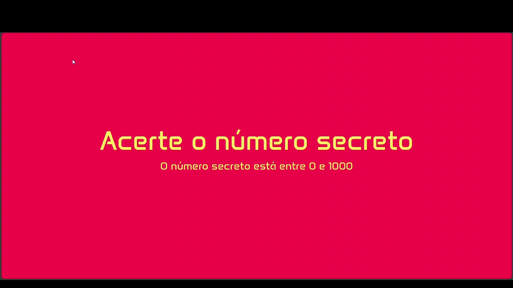

# 🎮 [Número Secreto](https://jogo-numero-secreto-yr3h.vercel.app/)

[](https://developer.mozilla.org/pt-BR/docs/Web/HTML)
[](https://developer.mozilla.org/pt-BR/docs/Web/CSS)
[](https://developer.mozilla.org/pt-BR/docs/Web/JavaScript)
[](https://nodejs.org/)
[](https://expressjs.com/)
[](https://vercel.com/)
[](LICENSE)

---

## 🔹 Sobre o projeto

Número Secreto é um jogo interativo **acionado pela sua voz**, desenvolvido como projeto acadêmico durante o curso da Alura.  
O objetivo é adivinhar o número que a máquina escolheu (entre 0 e 1000).
A cada tentativa, a máquina indica se o número secreto é maior ou menor até você acertar.

- Aprendi a utilizar a **API de reconhecimento de voz** do navegador.
- Desenvolvido com **JavaScript, HTML e CSS**
- Deploy online feito na **Vercel**.

---

## 🎬 Preview



---

## 🛠️ Tecnologias Utilizadas

- **Frontend**: HTML, CSS, JavaScript
- **Backend**: Node.js + Express
- **Deploy**: Vercel
- **API**: Web Speech API (Reconhecimento de voz)

---

## ⚡ Funcionalidades

- Chute números por voz usando o microfone
- Receba dicas: número secreto é maior ou menor
- Validação de entrada (0 a 1000)
- Tela de vitória com opção de jogar novamente

---

## 💡 Como executar localmente

1. Clone o repositório:
```bash
git clone https://github.com/UelintonHJ/jogo-numero-secreto
```

2. Instale as dependências:
```bash
npm install
```

3. Rode o servidor:
```bash
node api/server.js
```

4. Abra o navegador e acesse:
```bash
http://localhost:3000
```

---

## 📚 Licença 

> **Número Secreto** é um jogo web interativo que combina reconhecimento de voz e lógica de adivinhação. 
> Desenvolvido na [Alura](https://www.alura.com.br/).
